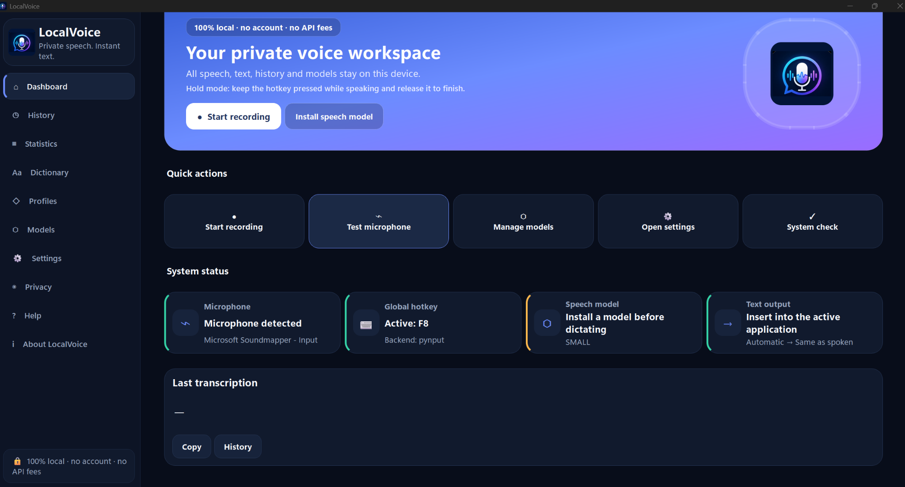
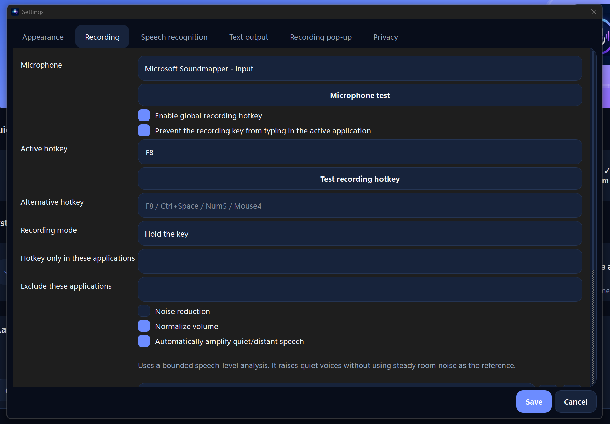
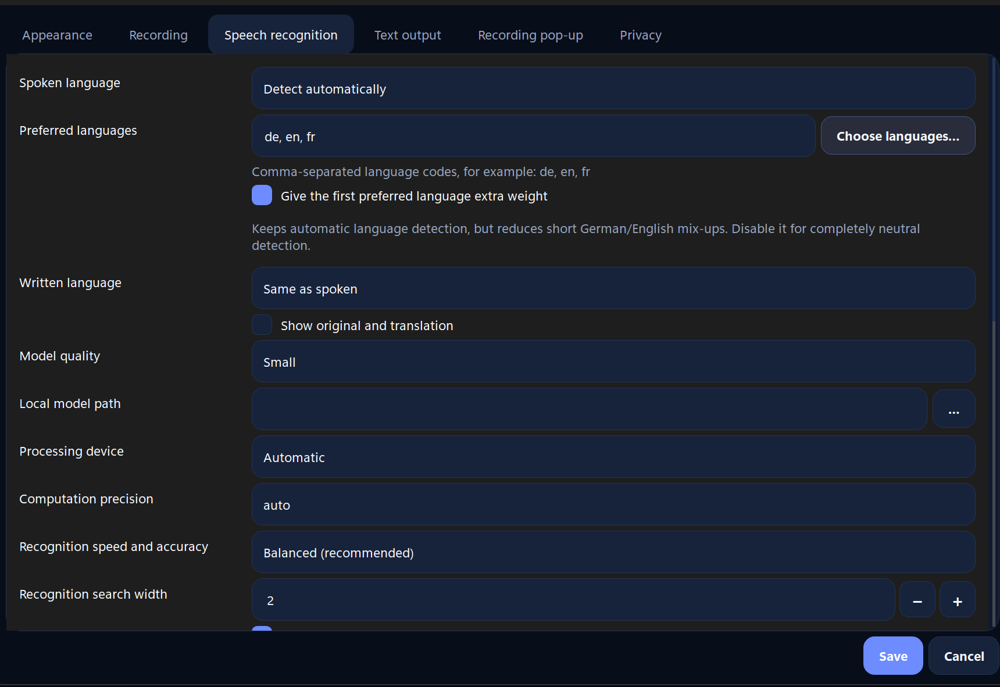
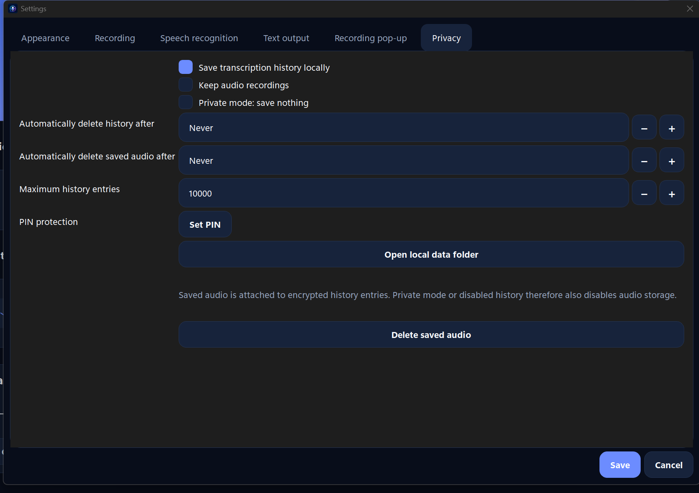

<p align="center">
  
</p>

<h1 align="center">LocalVoice</h1>

<p align="center">
  <strong>Private Offline-Spracherkennung und lokale Übersetzung für Windows und Linux.</strong><br>
  Kein Konto. Keine Werbung. Keine kostenpflichtige API. Deine Stimme bleibt auf deinem Gerät.
</p>

<p align="center">
  <a href="README.md">English</a> ·
  <a href="#download">Download</a> ·
  <a href="#funktionen">Funktionen</a> ·
  <a href="#selbst-erstellen">Selbst erstellen</a> ·
  <a href="SECURITY.md">Sicherheit</a>
</p>

## Übersicht

LocalVoice ist eine kostenlose Open-Source-Desktop-App, die Sprache vollständig lokal in Text umwandelt. Du kannst eine frei wählbare Taste gedrückt halten oder einmal zum Starten und erneut zum Stoppen drücken. Der erkannte Text wird direkt in das aktive Programm eingefügt, in die Zwischenablage kopiert, als Vorschau angezeigt oder nur in LocalVoice gespeichert.

Nach der ausdrücklichen Installation der benötigten Modelle laufen Spracherkennung und optionale Übersetzung lokal auf dem Computer. Es gibt kein Konto, kein Abonnement, keine Werbung und keine kostenpflichtige API.

## Screenshots

### Startseite



<details>
<summary><strong>Weitere Screenshots anzeigen</strong></summary>

### Aufnahme-Einstellungen



### Spracherkennung und Übersetzung



### Datenschutz und lokale Daten



</details>

## Download

Der Windows-Installer und die Linux-Pakete werden unter **GitHub Releases** veröffentlicht.

Die EXE-Installer-Datei kann später hochgeladen werden. Die vorbereiteten Schritte stehen in [`docs/RELEASING.md`](docs/RELEASING.md).

## Funktionen

### Diktieren

- Zwei Aufnahmemodi: Taste gedrückt halten oder Start-/Stop-Umschaltung
- Frei wählbare globale Haupt- und Ersatztaste
- Sichtbares Aufnahme-Pop-up mit Zeit, Pegel, Status und Bedienelementen
- Direkte Texteingabe in das aktive Programm
- Ausgabe in Zwischenablage, Vorschau oder nur in LocalVoice
- Mikrofonwahl und Mikrofontest
- Lautstärkenormalisierung, Verstärkung und optionale Rauschminderung
- Automatische Verstärkung leiser oder weiter entfernter Sprache
- Lange Aufnahmen und Live-Teiltranskription

### Sprachen und Übersetzung

- Automatische Spracherkennung
- Feste Eingabesprache und bevorzugte Sprachen
- Mehrsprachige lokale Whisper-Spracherkennung
- Feste Zielsprache und automatische Übersetzungsregeln
- Original und Übersetzung gemeinsam ausgeben
- Vollständige App-Oberfläche auf Deutsch, Englisch, Französisch, Italienisch, Spanisch und vereinfachtem Chinesisch

### Produktivität

- Persönliches Wörterbuch und eigene Ersetzungen
- Profile für einzelne Programme
- Automatische Satzzeichen und gesprochene Bearbeitungsbefehle
- Lokaler durchsuchbarer und bearbeitbarer Verlauf
- Statistiken, Export und Aufbewahrungsfristen
- System-Tray, Autostart, Dark/Light/System und UI-Größen

### Datenschutz und Sicherheit

- Lokale Verarbeitung
- Kein Konto, keine Werbung, kein Abo und keine versteckten API-Aufrufe
- Verschlüsselter Verlauf, Profile, Wörterbuch und optionale Audiodateien
- AES-256-GCM für lokale Daten
- Optionaler PIN-Schutz mit Scrypt
- Windows-DPAPI und Linux-Schlüsselbund, soweit verfügbar
- Privater Modus ohne Speicherung
- Modelle werden nur ausdrücklich über den Modellmanager heruntergeladen

## Download-Dateien

Geplant sind:

```text
LocalVoice-Setup-Windows-x64.exe
LocalVoice-Windows-x64-Portable.zip
LocalVoice-Linux-x86_64.AppImage
LocalVoice-Linux-amd64.deb
LocalVoice-Linux-x64.tar.gz
SHA256SUMS.txt
```

## Selbst erstellen

### Windows

Voraussetzungen:

- Windows 10 oder 11, 64 Bit
- Python 3.12, 64 Bit
- Inno Setup 6
- PowerShell

```powershell
Set-ExecutionPolicy -Scope Process Bypass
.\scripts\Build-Windows.ps1
```

Ausgaben:

```text
dist\LocalVoice\LocalVoice.exe
release\windows\LocalVoice-Setup-Windows-x64.exe
```

### Linux

```bash
bash scripts/Build-Linux.sh
```

Weitere Informationen stehen in [`docs/BUILDING.md`](docs/BUILDING.md).

## Mitmachen

Beiträge sind willkommen. Bitte zuerst [`CONTRIBUTING.md`](CONTRIBUTING.md) lesen.

## Lizenz

LocalVoice wird unter der [MIT-Lizenz](LICENSE) veröffentlicht.

Copyright © 2026 Rahmi Apps.
